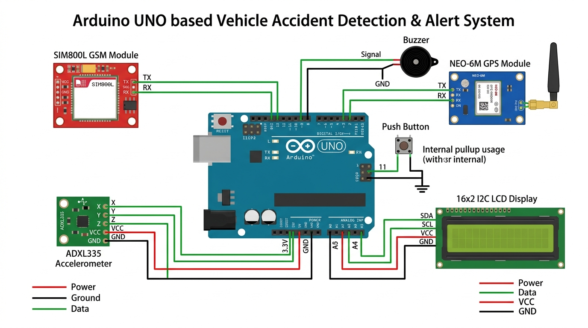

# 🚗 Vehicle Accident Detection & Alert System

> **Arduino UNO** based real-time crash detection system using accelerometer, GPS & GSM module.



---

## 📋 Project Overview

This system detects vehicle accidents in real-time using an **ADXL335 accelerometer** to measure sudden impact/g-force. When a crash is detected:

1. 🔔 **Buzzer sounds** an alert immediately
2. 📍 **GPS location** is captured via NEO-6M module
3. 📱 **Phone call** is made to emergency contact via SIM800L GSM
4. 📩 **SMS is sent** with Google Maps link of the crash location
5. ⏹️ **Cancel button** allows the driver to cancel false alerts within 30 seconds

---

## 🔧 Components Required

| # | Component | Quantity | Description |
|---|-----------|----------|-------------|
| 1 | Arduino UNO (ATmega328P) | 1 | Main microcontroller board |
| 2 | SIM800L GSM Module | 1 | For making calls & sending SMS |
| 3 | NEO-6M GPS Module | 1 | For getting GPS coordinates |
| 4 | ADXL335 Accelerometer | 1 | 3-axis analog accelerometer for impact detection |
| 5 | 16x2 I2C LCD Display | 1 | For displaying status (I2C address: 0x27) |
| 6 | Buzzer (Active) | 1 | For audible crash alert |
| 7 | Push Button | 1 | Cancel button to dismiss false alerts |
| 8 | SIM Card (2G) | 1 | For GSM module (must support 2G network) |
| 9 | GPS Antenna | 1 | Usually comes with NEO-6M module |
| 10 | Jumper Wires | ~20 | Male-to-Male & Male-to-Female |
| 11 | Breadboard | 1 | For prototyping connections |
| 12 | Power Supply | 1 | 5V USB or battery pack |

---

## âš¡ Circuit Wiring Diagram

### Complete Pin Connection Table

| Component | Component Pin | Wire Color | Arduino UNO Pin | Description |
|-----------|--------------|------------|-----------------|-------------|
| **SIM800L GSM** | TX | 🟢 Green | Digital Pin 2 (rxPin) | GSM transmits data → Arduino receives (SoftwareSerial RX) |
| **SIM800L GSM** | RX | 🟢 Green | Digital Pin 3 (txPin) | Arduino transmits AT commands → GSM receives (SoftwareSerial TX) |
| **SIM800L GSM** | VCC | 🔴 Red | 5V (via buck converter) | Power supply (needs 3.4V-4.4V) |
| **SIM800L GSM** | GND | âš« Black | GND | Common ground |
| **NEO-6M GPS** | TX | 🟢 Green | Digital Pin 8 | GPS transmits NMEA data → Arduino (AltSoftSerial fixed RX) |
| **NEO-6M GPS** | RX | 🟢 Green | Digital Pin 9 | Arduino → GPS commands (AltSoftSerial fixed TX) |
| **NEO-6M GPS** | VCC | 🔴 Red | 5V | Power supply |
| **NEO-6M GPS** | GND | âš« Black | GND | Common ground |
| **ADXL335** | X | 🟢 Green | Analog Pin A1 | X-axis acceleration output |
| **ADXL335** | Y | 🟢 Green | Analog Pin A2 | Y-axis acceleration output |
| **ADXL335** | Z | 🟢 Green | Analog Pin A3 | Z-axis acceleration output |
| **ADXL335** | VCC | 🔴 Red | **3.3V** ⚠️ | **MUST use 3.3V (NOT 5V!)** |
| **ADXL335** | GND | âš« Black | GND | Common ground |
| **I2C LCD 16x2** | SDA | 🟢 Green | Analog Pin A4 | I2C data line |
| **I2C LCD 16x2** | SCL | 🟢 Green | Analog Pin A5 | I2C clock line |
| **I2C LCD 16x2** | VCC | 🔴 Red | 5V | Power supply |
| **I2C LCD 16x2** | GND | âš« Black | GND | Common ground |
| **Buzzer** | Signal (+) | 🟢 Green | Digital Pin 12 | HIGH = buzzer ON |
| **Buzzer** | GND (-) | âš« Black | GND | Common ground |
| **Push Button** | Side 1 | 🟢 Green | Digital Pin 11 | Cancel button (uses internal pullup) |
| **Push Button** | Side 2 | âš« Black | GND | Press pulls pin LOW |

> 📄 **Full wiring data also available as CSV:** [wiring.csv](wiring.csv)

---

## 📌 Pin Summary (Quick Reference)

```
ARDUINO UNO PIN MAP
═══════════════════════════════════════════════
 DIGITAL PINS:
   Pin 2  ← SIM800L TX  (SoftwareSerial RX)
   Pin 3  → SIM800L RX  (SoftwareSerial TX)
   Pin 8  ← NEO-6M TX   (AltSoftSerial RX) [FIXED]
   Pin 9  → NEO-6M RX   (AltSoftSerial TX) [FIXED]
   Pin 11 ← Push Button  (INPUT_PULLUP)
   Pin 12 → Buzzer        (OUTPUT)

 ANALOG PINS:
   A1 ← ADXL335 X-axis
   A2 ← ADXL335 Y-axis
   A3 ← ADXL335 Z-axis
   A4 ↔ I2C LCD SDA      [FIXED I2C]
   A5 ↔ I2C LCD SCL      [FIXED I2C]

 POWER:
   5V   → SIM800L, NEO-6M, LCD
   3.3V → ADXL335 (⚠️ MUST be 3.3V!)
   GND  → All components (common ground)
═══════════════════════════════════════════════
```

---

## 📁 Project Structure

```
acc/
├── README.md                          ← This file
├── arduino-uno-wiring.jpg             ← Circuit wiring diagram
├── wiring.csv                         ← Wiring connections in CSV format
├── accident-alert-gsm/                ← Arduino NANO version
│   └── accident-alert-gsm.ino
├── accident-alert-gsm-uno/            ← Arduino UNO version ⭐
│   └── accident-alert-gsm-uno.ino
├── algorithm-test/                    ← Impact algorithm test sketch
│   └── algorithm-test.ino
├── i2c-scanner/                       ← I2C address scanner utility
│   └── i2c-scanner.ino
├── lcd-test/                          ← LCD display test sketch
│   └── lcd-test.ino
├── libraries/                         ← Required libraries
│   ├── AltSoftSerial-master/          ← GPS serial communication
│   ├── Arduino-LiquidCrystal-I2C-library-master/  ← I2C LCD
│   └── TinyGPSPlus/                   ← GPS NMEA parsing
└── Improved Crash Detection Algorithm for Vehicle Crash Detection.pdf
```

---

## 🚀 How to Upload (Arduino UNO)

1. **Open** `accident-alert-gsm-uno/accident-alert-gsm-uno.ino` in Arduino IDE
2. **Install Libraries** — Copy all folders from `libraries/` into your Arduino libraries folder:
   - `AltSoftSerial`
   - `LiquidCrystal_I2C`
   - `TinyGPSPlus`
3. **Set Emergency Phone Number** — Edit line in code:
   ```cpp
   const String EMERGENCY_PHONE = "+91XXXXXXXXXX";  // Your number with country code
   ```
4. **Select Board** → `Tools` → `Board` → `Arduino UNO`
5. **Select Port** → `Tools` → `Port` → Your COM port
6. **Upload** → Click ▶️ Upload button
7. **Open Serial Monitor** at `9600 baud` to see debug output

---

## ⚙️ How It Works

```
┌─────────────────────────────────────────────────────────┐
│                    SYSTEM FLOWCHART                      │
├─────────────────────────────────────────────────────────┤
│                                                         │
│  START → Read Accelerometer (every 2ms)                 │
│            │                                            │
│            ├─ Calculate magnitude of change              │
│            │   magnitude = √(Δx² + Δy² + Δz²)          │
│            │                                            │
│            ├─ magnitude ≥ 20 (sensitivity)?             │
│            │     │                                      │
│            │     ├─ YES → Impact Detected!              │
│            │     │         ├─ Buzzer ON 🔔              │
│            │     │         ├─ Get GPS Location 📍       │
│            │     │         ├─ Show on LCD 📺            │
│            │     │         ├─ Wait 30 seconds ⏱️        │
│            │     │         │    │                        │
│            │     │         │    ├─ Button pressed?       │
│            │     │         │    │   └─ YES → Cancel ❌   │
│            │     │         │    │                        │
│            │     │         │    └─ Timer expired?        │
│            │     │         │        └─ YES →             │
│            │     │         │          ├─ Make Call 📞    │
│            │     │         │          └─ Send SMS 📩    │
│            │     │         │            (with Maps link) │
│            │     │                                      │
│            │     └─ NO  → Continue monitoring            │
│            │                                            │
│            └─ Loop back ↩️                               │
└─────────────────────────────────────────────────────────┘
```

---

## ⚠️ Important Notes

| Note | Details |
|------|---------|
| **ADXL335 Voltage** | Connect to **3.3V ONLY** — connecting to 5V will damage the sensor! |
| **SIM800L Power** | Needs 3.4V-4.4V at 2A peak — use a buck converter or LiPo battery |
| **I2C Address** | Default LCD address is `0x27` — run `i2c-scanner.ino` to verify |
| **AltSoftSerial Pins** | Pins 8 & 9 are **FIXED** for AltSoftSerial on UNO — cannot be changed |
| **2G Network** | SIM800L only supports 2G — ensure your carrier supports 2G |
| **GPS First Fix** | First GPS fix can take 1-5 minutes outdoors with clear sky view |
| **Sensitivity** | Default sensitivity is `20` — increase for less sensitive, decrease for more |
| **Alert Delay** | 30 second delay before sending alert — driver can cancel with button |

---

## 📞 SMS Alert Format

When accident is detected, the emergency contact receives:
```
Accident Alert!!
http://maps.google.com/maps?q=loc:28.612912,77.229510
```
*(Clicking the link opens Google Maps with exact crash location)*

---

## 📞 "Get GPS" SMS Command

Send SMS with text `get gps` from the emergency phone number to get current location:
```
GPS Location Data
http://maps.google.com/maps?q=loc:28.612912,77.229510
```

---

## 🔌 Arduino Nano vs Arduino UNO

| Feature | Arduino Nano | Arduino UNO |
|---------|-------------|-------------|
| Microcontroller | ATmega328P | ATmega328P |
| Digital I/O Pins | 14 | 14 |
| Analog Input Pins | 8 | 6 |
| Flash Memory | 32 KB | 32 KB |
| SRAM | 2 KB | 2 KB |
| Clock Speed | 16 MHz | 16 MHz |
| **Pin Mapping** | **Same** | **Same** |
| **Code Compatibility** | ✅ | ✅ |

> Both boards use the **same ATmega328P** chip — the code is functionally identical. Only the board form factor differs.

---

## 📜 License

This project is open source for educational purposes.

---

*Made with ❤️ for road safety*
